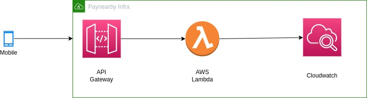
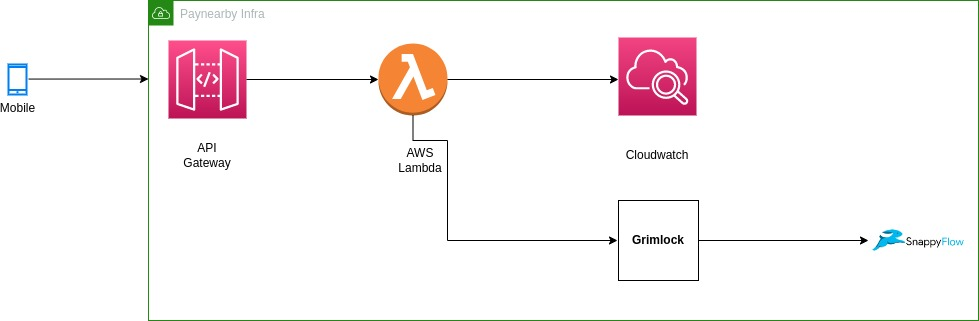

# Grimlock
An highly scalable application that will ingest the logs from mobile and will push these logs into the snappyflow.

## Previous Architecture


## Current Architecture


## Data Flow: Grimlock
Grimlock service consisit of two parts:
1) **Ingestor API:** This API ingest the logs from mobile and pushes it to kafka asynchronously.
2) **Consumer API:** This API consumes the logs from kafka, writes them into the file system and snappyflow reads the logs from those files.

## Grimlock Internal Architecture
ALB  -----------> Ingestor API  ------------> Kafka ------------> Consumer API --------> Snappyflow

## Future Problem to Solve
 - **Sync Data to BQ:** 
   - As we move forward with Grimlock, we had an option to sync these logs to BQ as we have data available in Kafka.
   - From Kafka, we can dump the data to BQ parallelly.

 - **Ingest Events Data:**
   - We generate a lot of user events from our app today and a lot of engineering efforts are going around to ingest, process and analyze those events.
   - Grimlock can be evolved to ingest the events data as well in the future.
   
 - **Single Integration Point to Marketing Tools:**
   - Today we do a lot of integrations with user retention and marketing tools like Clevertap, MoEngage to retain our users and for better user interaction.       
   - We do a lot of independent integrations with these tools which requires a lot of time and effort.
   - As we ingest events data via Grimlock, it will become the central application that can be integrated with any of the third-party marketing tools.

## Lambda Vs EC2 Vs App Runner
AWS Lambda | AWS App Runner |
--- | --- |
Single concurrent request per Lambda function instance, but many separate Lambda function instances. | Multiple concurrent requests per container, enforces a configurable hard limit such as 100 concurrent reqs/container.
Fully managed by AWS Lambda, default limit of 1000 concurrent executions. Scale-out more function instances in under a second. | Fully managed by App Runner. Configure a concurrency limit per containerized process. Scale-out more container instances in less than 1 min.
Pay per ms of time for each individual execution. No charge when there are no executions. | Pay per second, per App Runner container, based on CPU and memory size. Container price per second is the same when serving one request or many concurrent requests. There is a discounted price when there are no requests and the CPU is not active.
Launch your own API Gateway or load balancer and pay for it separately. | Fully managed, load balancer ingress included in AWS App Runner cost.
Code Format can be a ZIP file or a container image. | Code Format can be a  Container Image or a Git repo.

## Why we are choosing EC2
 - As we have seen aws lambda does not support asynchronous operations, we have not chosen aws lambda for building Grimlock as our application requires high throughput asynchronous posting and polling from apache kafka.
 - We have not chosen aws apprunner as Grimlock underlying infrastructure because this is helpful when we do not know the scale but on the contrary, we know our current scale and Grimlock can sustain a 10X scale as compared to what we have today.

## Benchmarking Results
|   |   |
|---|---|
**Current Scale** | **~250 requests/sec**
**Grimlock Capacity** | **~5000 request/sec**
**Current Response Time** | **~60 ms**
**Grimlock Response Time** | **~4 ms**
**Total Response Time( Grimlock + Lambda )** | **~120 ms**

#### 
**Note**: _Total Response Time is higher because AWS Lambda does not support asynchronous calls._

## API Contract:
```http
POST /api/v1/logs/{path_parameter}
```
### Request Headers
Name | Type | M/O | Description
--- | --- | ---| ---|
AppKey | String | M | Static Authorization key/ JWT Token

### Request Payload
Name | Type | M/O | Description
--- | --- | ---| ---|
source | string | O | Name of the mobile OS
log_type | string | O | Log type
app_key | string | O | App Key
app_version | string | O | App Version
mobile_number | string | O | Mobile Number of User
device_details | string | O | Details of the device
user_id | string | O | Id of the user
ip_address | string | O | IP Address
desc | string | O | Description about the event
data | string | O | Actual log data
app_platform | string | O | Name of the app platform E.g, pnb-merchant-android
timestamp | string | O | Timestamp in epoch ( in milliseconds )
env | string | O | Environment type E.g, uat

### Response

#### If API is successful
|    |     |
--- | --- |
| Status Code | 200 |
| Response | {‘msg’: ‘Logs posted Successfully’} | 

#### If Headers are missing
|    |     |
--- | --- |
| Status Code | 403 |
| Response | {"errors":{"error_description": "Please provide authorization token", "error_type": "token_expired"}} | 


 
